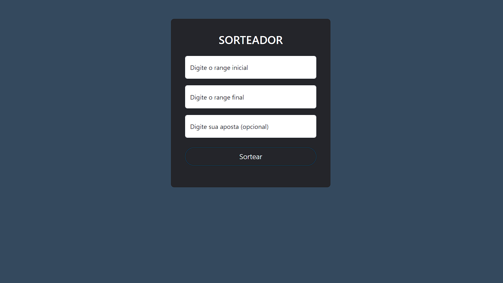
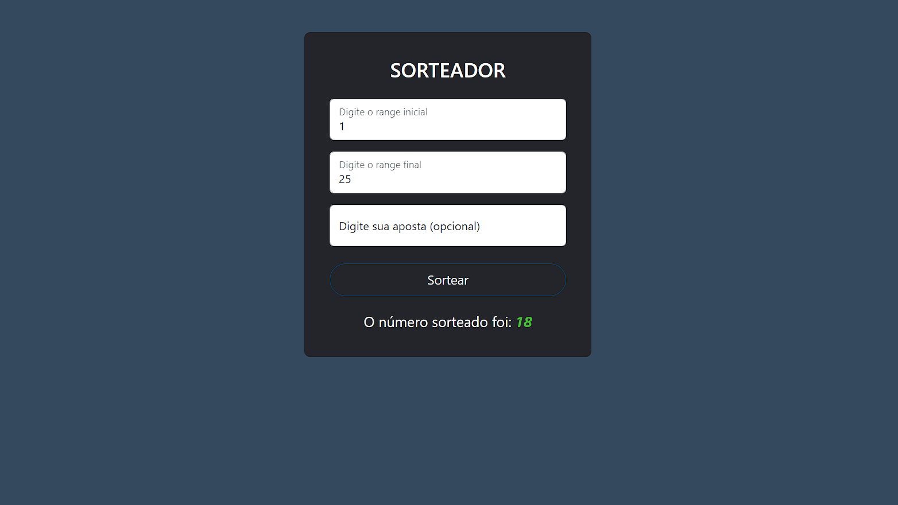

# Sorteador

    
    

Sorteador de números com range inicial e range final.

## :hammer: Funcionalidades do projeto
- `Sortear números:` realiza o sorteio de números conforme o range inicial e final informado pelo usuário.
- `Adivinhar número:` o usuário pode tentar adivinhar qual será o número sorteado especificando esse número.

 

## :file_folder: Acesso ao projeto
Você pode [acessar o código-fonte do projeto](https://github.com/GabrielSchiavo/sorteador) ou [baixá-lo](https://github.com/GabrielSchiavo/sorteador/archive/refs/heads/main.zip).

## 	:hammer_and_wrench: Abrir e rodar o projeto
Depois de baixar o projeto, você pode abrir com o Visual Studio Code.

Após, copie o caminho do arquivo "index.html" e cole na caixa de busca do seu navegador.

Agora o sorteador estará pronto para uso.

## :white_check_mark: Tecnologias utilizadas
* `Bootstrap - 5.2.0`
* `HTML5 e CSS3`
* `JavaScript`
* `jQuery - 3.6.0`
